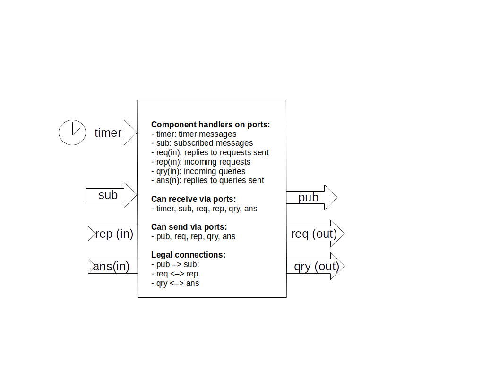
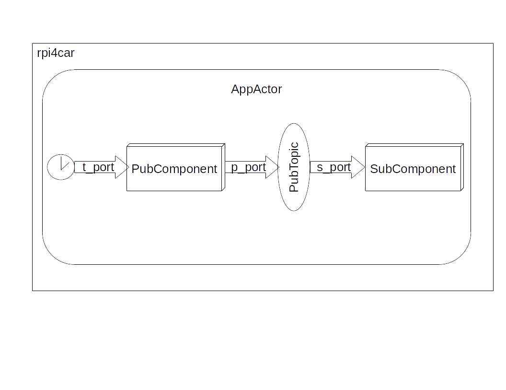

# The SLACM Application Model

A SLACM application consists of *components* that run inside *actors* that execute on *hosts*.
A component is an object: an instance of a class in Python, that has a single execution thread
that executes all component operations. An actor is a process that contains components, each running
its own thread. A host is a node on the network that is capable of running SLACM applications,
i.e. it has all SLACM packages installed. 
 
The SLACM application developer creates components and creates an *application model* that
represents how to application is assembled from components and how it is installed on the hosts. 
Optionally, a file containing the parameter settings for the components can be supplied, as well 
as configuration files that sets specific system configuration parameters. This package is handed
to the SLACM tool (called 'slacm_run') that runs the application.

## Components

A SLACM component is an object that has an execution thread, created by the framework. Components
are *reactive*: they react to messages that are sent to the component. When the framework creates 
a component it runs its constructor then it launches the component's thread that 
waits for messages sent to the component. 

A component interacts with other components in the application via a messages, which are routed
through *ports* that belong to components. A component 'owns' its port, but its port are 'wired' 
to ports of other components as described by the application model. 

A port can be of type input, output, or both. Input and 'both' type ports can be used to receive 
a message, output and 'both' type ports can be used to send a message. The component code calls 
the appropriate 'send' or 'receive' operation on the port object it owns.

A component is always reactive: it reacts to messages arriving at its input ports. Each input port
must have a corresponding *message handler* -- a method of the component object, that will be called
by the framework when a message arrives at a component. This handler **must** read (receive) the
message from the port, and *can* send messages to output (or 'both' type) ports. 

### Port types and component interactions

#### Timer port

This is an input port that sends *timer messages* to the component. It is either periodic (with a fixed
periodicity) or aperiodic (with a programmable delay). The message received on the timer port is 
a floating point number as generated by the `time.time()` function of Python.

#### Component interactions

SLACM is based on a subset of the communication patterns provided by ZeroMQ.  A communication
pattern specifies how messages are passed from component port to component port, and what 
protocol should the developer follow when using them. 
 
##### Publish/subscribe

In this scheme, *publisher* components send messages through their 'publish' (`pub`) ports that get delivered
to all 'subscriber' (`sub`) ports of *subscriber* components connected to the source ports. The communication 
pattern is many-to-many (i.e. one publisher can send to many subscribers, and one subscriber can receive from many 
publishers) and uni-directional (i.e. messages always from `pub`-s to `sub`-s.

##### Request/reply

This is a bi-directional scheme where a *client* component sends a message through its 'request' (`req`) port that
goes to a *server* component's 'reply' (`rep`) port. The server's input handler should read this message, and generate 
a response message and send it through the **same** `rep` port, so that the message will be routed to to the **same**
`req` port of the client, whose handler will be triggered, and this handler must read the message. 

This approach implements a full round trip but it has a limitation. The client cannot send a new message *until it 
has read the response message to a previous request message*. In other words, the client/server must operate in a 
lock-step: client -> server -> client -> server, etc. As consequence, the server will always process (and respond to)
the incoming messages in the order of their arrival. 


##### Query/answer

This scheme is similar to *request/reply* scheme except it has no restriction: the client can send messages without 
waiting for the responses. Furthermore, the server can process and respond to messages in arbitrary order. The 
correspoding port types are called 'query' (`qry`) and 'answer' (`ans`).


Note that the developer creates the code for the component message handlers, one for each input (or 'both') type ports.
The handler is called by the framework. The port objects are also created by the framework, and they provide the 
send and receive operations that the handler should use. 


The figure below shows  (1) all the possible ports of a component, (2) the handlers that must be implemented by 
the component, (3) the port types that support send and receive operations, and (4) the allowed connections among the ports. 
 



## Applications

The model of a SLACM application represents how the application is composed. The model specifies
- the name of the application
- the message topics the application uses
- the components the application is built from 
- the actors that contain components
- the hosts the application is to be run on

The example below shows a simple application model.

```
app App:	                // Application call 'App'
   msg PubTopic             // A message topic
   
   component PubComponent:  // A component that publishes messages
      timer t_port 1000     // has a timer port 
      pub p_port : PubTopic // has publisher port
    
   component SubComponent:  // Another component tat subscribes to messages
      sub s_port : PubTopic // has a subscriber port
		 
   actor AppActor:          // An actor that contains both components
      thePublisher : PubComponent
      theSubscriber: SubComponent
    
   host (rpi4car) AppActor  // The actor will run on host 'rpi4car'
```

The components communicate via messages, and each message belongs to a *topic*. This is just a label 
used in wiring up the components. The components can send any Python objects via the ports, and the developer
is responsible for constructing and interpreting thos data structures. The topics are merely used for connecting
the ports, but the content and formatting of the messages is the responsibility of the developer. Note that ZeroMQ 
provides operations for send/receiving Python objects (`send_pyobj`/`recv_pyobj`, as well as byte arrays (`send`/`recv`).

The wiring of component ports happens via matching the topics and following the connection rules between ports (as 
indicated on the component illustration above). 

The simple application model introduces an application (`App`), and a message topic called `PubTopic`. Next,
defines two components. The first, `PubComponent` has a timer port, called `t_port` which is attached to a periodic timer
that fires every 1000 msec. It also has a `pub` port called `p_port` tha publishes messages of topic `PubTopic`.

The second component, `SubComponent` has a `sub` port called `s_port` that subscribes to messages of topic `SubTopic`.

The two components are packaged into a single actor called `AppActor`, and the component instancess are called `thePublisher` 
and `theSubscriber`, respectively.

 
Finally, the application is to be run on a host on the network called `rpi4car` that will execute a copy of the `AppActor`. This 
last depoyment specification can be missing, in which case the all actors of the application will run on the host the application files 
are located. If a deployment is specified, the SLAC will copy the specified application actor(s) to the remote host(s) and runs them there. 
For the latter, the remote hosts (1) must be accesible via public/private key, no password SSH logins, and (2) must have SLACM installed.


The figure below shows the architecture of the application described by the model. 
  


SLACM determines the 'wiring' (i.e. connections) between the component ports based on the message topic the port handled. In the above 
example the `p_port` published 'PubTopic' messages, hence it got connected to the `s_port` because that subscribed to such topics. Note that 
the matching by name is *complete*: if a component publishes topic `X` and subscribes to the same topic `X` then it will receive (and will be
triggered by) its own messages. 

The following sample shows how to use other port types.

```
...
    message SensorReady
    message SensorQuery 
    message SensorValue 
...
   component Sensor:
      timer clock 1000 							// Periodic timer trigger to trigger sensor every 1 sec
      pub ready : SensorReady					// Publish port for SensorReady messages 
      rep request : ( SensorQuery , SensorValue ) // Reply port to query the sensor and retrieve its value

    component LocalEstimator:
      sub ready : SensorReady					// Subscriber port to trigger component with SensorReady messages
      req query : (SensorQuery , SensorValue )	// Request port to query the sensor and retrieve its value
    
...
```
In the above example the `req` and `rep` ports of the `Sensor` and the `LocalEstimator` components are connected becaus ethey have matching 
message topics (`SensorQuery` and `SensorValue`).NOte that for thise case there two message topics needed: one for the message going from the
`req` port to the `rep` port (`SensorQuery`), and another one for the message coming back (`SensorValue`). The `pub`/`sub` ports are wired as before. 

The above example implements a useful architectural template: the `Sensor` components is triggered periodically, and it publishes a `SensorReady` 
message when a new block of data is ready. This is only a *notification* event that triggers the `LocalEstimator` component, which, in turn, can
request the actual data itself via the `query` port. Note that `query` port serves both for sending and receiving messages, just like the `request`
port of the `Sensor`.

Note that the '`req`/`rep` interaction pattern follows a strict protocol as discussed above. This is relaxed to for the `qry`/`ans` that can be used as
a replacement. 
```
...
    message MsgReq
    message MsgRep
    
    component HelloQuery:
      timer clock 1000
      qry port : (MsgReq,MsgRep)
    
    component HelloAnswer:
      ans port : (MsgReq,MsgRep)
 ... 	
 ```
However, in this case, there is more work to be done  on the `answer` side: the 'server' must keep track of the identity of the 'client' (see subsequent example).
 

 

